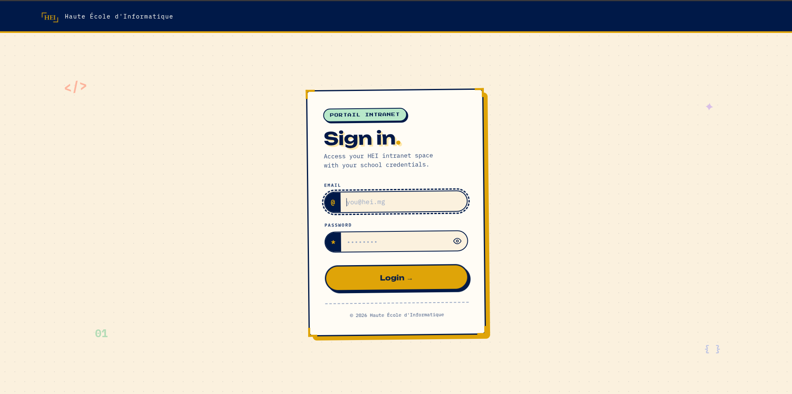
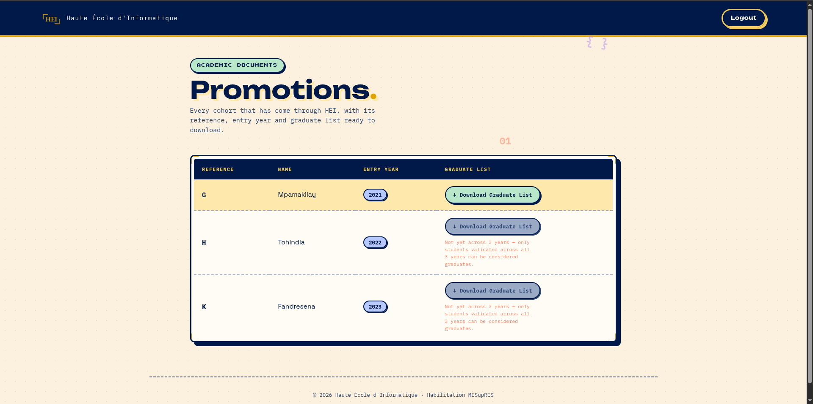

<div align="center">

# HEI Management API

**A secure, production-grade school management platform built with Spring Boot.**


---

*Inspired by [hei-admin-api](https://github.com/hei-admin), rebuilt with stricter business rules,
complete audit trails, and role-based access control.*

</div>

## Overview

HEI Management API is the backend for the Haute Ecole d'Informatique administrative portal.
It manages the full academic lifecycle: promotions, students, teachers, courses, groups,
exams, grades, transcripts, and graduate lists.

The API enforces strict business validation at every level, ensuring data integrity across
all operations while maintaining a clean, layered architecture.

<div align="center">



*Login page with HEI branding*

</div>

<div align="center">



*Promotions dashboard with graduate list export*

</div>

## Architecture

```
Controller --> Service --> Validator --> Repository --> PostgreSQL
                  |
              Mapper (x4)
              - REST DTO
              - Domain Model
              - JPA Entity
              - Generic Model
```

**Separation of concerns is strict:**
- Controllers handle HTTP routing and response mapping.
- Services orchestrate business logic. Service methods return domain models, never JPA entities.
- Validators own all business rule enforcement. Services call validators and proceed, nothing more.
- Repositories handle data access and return JPA entities, never domain models.
- Mappers convert between the four model layers.

## Roles and Access

| Role | Capabilities |
|---|---|
| **ADMIN** | Full CRUD on all entities, manage promotions, export graduate lists, view all grades |
| **TEACHER** | Create/update exams and grades for assigned courses, view own courses |
| **STUDENT** | View own grades, transcripts, curriculum status, and graduate eligibility |

Authorization is enforced at the service layer via `SecurityUtil` and at the controller
layer via Spring Security's role-based rules. JWT is used for the API; HTTP Basic for the
Thymeleaf UI.

## API Endpoints

### Authentication

| Method | Endpoint | Description | Access |
|---|---|---|---|
| POST | `/auth/login` | JWT login, returns token | Public |
| GET | `/ui/login` | Login page (Thymeleaf) | Public |
| POST | `/ui/login` | Submit login form | Public |
| POST | `/ui/logout` | Logout | Authenticated |
| GET | `/ui/forbidden` | Access denied page | Authenticated |

### Admins

| Method | Endpoint | Description | Access |
|---|---|---|---|
| GET | `/admins/{id}` | Get admin by ID | Admin (self) |
| PUT | `/admins/{id}` | Update own profile | Admin (self) |

### Students

| Method | Endpoint | Description | Access |
|---|---|---|---|
| GET | `/students` | List all students | Admin |
| GET | `/students/{id}` | Get student by ID | Admin, Self |
| PUT | `/students` | Create or update student | Admin |
| DELETE | `/students/{id}` | Soft delete student | Admin |
| GET | `/students/{id}/group-flows` | View group transition history | Admin, Self |
| PUT | `/students/{id}/group-flows` | Move student to a new group | Admin |
| GET | `/students/{id}/yearly-results/{level}` | Yearly results for a level (L1/L2/L3) | Admin, Self |
| GET | `/students/{id}/results-summary` | Full 3-year transcript summary | Admin, Self |
| POST | `/students/{id}/yearly-results/{level}/transcript` | Generate PDF transcript | Admin, Self |
| GET | `/students/{id}/grades` | All grades for a student | Admin, Teacher (own courses), Self |

### Teachers

| Method | Endpoint | Description | Access |
|---|---|---|---|
| GET | `/teachers` | List all teachers | Admin |
| GET | `/teachers/{id}` | Get teacher by ID | Admin, Teacher (self) |
| PUT | `/teachers` | Create or update teacher | Admin |
| DELETE | `/teachers/{id}` | Soft delete teacher | Admin |

### Courses

| Method | Endpoint | Description | Access |
|---|---|---|---|
| GET | `/courses` | List all courses | Admin, Teacher |
| GET | `/courses/{id}` | Get course by ID | Admin, Teacher |
| PUT | `/courses` | Create or update course | Admin |
| DELETE | `/courses/{id}` | Soft delete course | Admin |

### Groups

| Method | Endpoint | Description | Access |
|---|---|---|---|
| GET | `/groups` | List all groups | Admin |
| PUT | `/groups` | Create or update group | Admin |
| GET | `/groups/{id}/students` | List students in a group | Admin |

### Promotions

| Method | Endpoint | Description | Access |
|---|---|---|---|
| GET | `/promotions` | List all promotions | Admin, Student (own) |
| GET | `/promotions/{id}` | Get promotion by ID | Admin |
| PUT | `/promotions` | Create or update promotion | Admin |
| GET | `/promotions/{id}/courses` | Courses assigned to a promotion | Admin |
| GET | `/promotions/{id}/graduates` | List graduates (JSON) | Admin |
| GET | `/promotions/{id}/graduates/export` | Export graduates to XLSX, returns presigned URL | Admin |
| GET | `/promotions/{id}/graduates/download` | Direct download of graduate list XLSX | Admin |

### Course Assignments

| Method | Endpoint | Description | Access |
|---|---|---|---|
| GET | `/course-assignments` | Filtered list of course assignments | Admin, Teacher (own), Student (own) |
| GET | `/course-assignments/{id}` | Get assignment by ID | Admin |
| GET | `/course-assignments/curriculum-status` | Check missing courses per student | Admin, Student (own) |
| PUT | `/course-assignments` | Create or update course assignment | Admin |
| DELETE | `/course-assignments/{id}` | Delete course assignment | Admin |

### Exams

| Method | Endpoint | Description | Access |
|---|---|---|---|
| GET | `/course-assignments/{id}/exams` | List exams for a course assignment | Admin, Teacher (own), Student (own) |
| GET | `/course-assignments/{id}/exams/{id}` | Get exam by ID | Admin, Teacher (own), Student (own) |
| PUT | `/course-assignments/{id}/exams` | Create or update exam | Admin, Teacher (own) |
| DELETE | `/course-assignments/{id}/exams/{id}` | Delete exam | Admin, Teacher (own) |

### Grades

| Method | Endpoint | Description | Access |
|---|---|---|---|
| GET | `/exams/{id}/grades` | List all grades for an exam | Admin, Teacher (own) |
| PUT | `/exams/{id}/grades` | Bulk create grades for an exam | Admin, Teacher (own) |
| GET | `/exams/{id}/students/{id}/grade` | Get a student's grade for an exam | Admin, Teacher (own), Self |
| PATCH | `/exams/{id}/students/{id}/grade` | Correct a grade (reason required) | Admin, Teacher (own) |
| GET | `/grades/{id}` | Get grade by ID | Admin, Teacher (own), Self |
| DELETE | `/grades/{id}` | Soft delete grade | Admin, Teacher (own) |
| GET | `/grades/{id}/history` | View correction history for a grade | Admin, Teacher (own) |

### UI

| Method | Endpoint | Description | Access |
|---|---|---|---|
| GET | `/ui/promotions` | Promotions dashboard (Thymeleaf) | Admin |

### Documentation

| Method | Endpoint | Description | Access |
|---|---|---|---|
| GET | `/spec` | Swagger UI | Public |
| GET | `/openapi.yaml` | OpenAPI spec (YAML) | Public |

### Health Checks

| Method | Endpoint | Description | Access |
|---|---|---|---|
| GET | `/ping` | Health ping | Public |
| GET | `/health/db` | Database connectivity | Public |
| GET | `/health/email` | Email service check | Public |
| GET | `/health/bucket` | S3 bucket check | Public |
| GET | `/health/event1` | Event service check | Public |
| POST | `/health/event/uuids` | Event UUID test | Public |

## Business Rules

| Rule | Validator |
|---|---|
| A course can only be assigned to a group matching its track (EL/TN) | `CourseAssignmentValidator` |
| A student can only join a grouped track from semester 4 onward | `CourseAssignmentValidator` |
| A group cannot exceed 30 credits per semester | `CourseAssignmentValidator` |
| Exam coefficients must sum to exactly 1.0 | `ExamValidator` |
| Grade corrections require a mandatory reason | `GradeValidator` |
| All mutations are soft-deleted and fully audited via history tables | `GradeHistory`, `GroupFlow` |
| A student graduates only when all courses in their 3-year curriculum have an average >= 10 | `ResultService` |

## Audit Trail

Every critical mutation is tracked:

- **Grades** have a full history table: value before, value after, reason, who changed it, timestamp.
- **Group flows** record every student-to-group transition: join, leave, timestamp.
- **Soft deletes** are applied to grades, promotions, exams, teachers, and courses. Data is never lost.
- **Grade corrections** store the previous value and require an explicit reason. The bulk upsert endpoint
  only allows creation, not modification. All corrections go through the `correct()` path with validation.

## Testing

```bash
./gradlew test
```

Integration tests run against real PostgreSQL via Testcontainers. Every business rule,
authorization check, and edge case is covered.

```
Tests: 240+
Coverage: 98%
```

Tests verify:
- Role-based access (admin, teacher, student, unauthenticated)
- Business rule enforcement (credit limits, track matching, coefficient sums)
- Audit history (creation, correction, deletion)
- Edge cases (soft-deleted entities, overlapping assignments, race conditions)

## Getting Started

### Prerequisites

- Java 21
- Docker (for Testcontainers and local PostgreSQL)
- Gradle 8.5+

### Run

```bash
./gradlew bootRun
```

### Test

```bash
./gradlew test
```

### Format

```bash
./format.sh
```

### OpenAPI Docs

Once running, visit `/spec` for the interactive API documentation.

## Project Structure

```
src/main/java/org/cocojojo/mg/
  endpoint/rest/
    controller/          # REST endpoints
    security/            # JWT filter, SecurityConfig
  service/               # Business logic
  validator/             # Business rule enforcement
  repository/            # JPA repositories
  mapper/                # Object mapping between layers
  model/                 # Domain models and enums
  repository/model/      # JPA entities
  util/                  # StdRefGenerator, SecurityUtil
  file/                  # S3 bucket operations

src/main/resources/
  db/migration/          # Flyway SQL migrations
  templates/             # Thymeleaf views
  static/                # CSS, images

src/test/java/.../it/    # Integration tests
```

---

<div align="center">

Built for **HEI** -- Haute Ecole d'Informatique, Antananarivo

</div>
